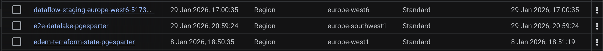
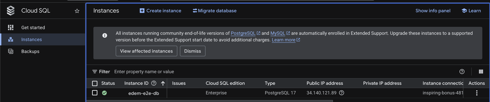
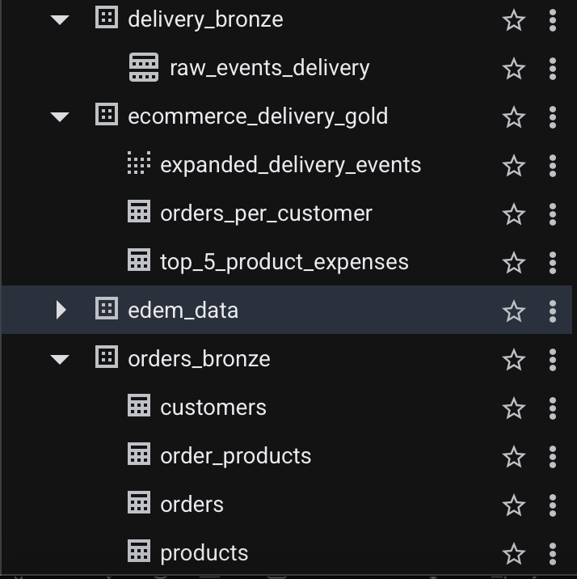
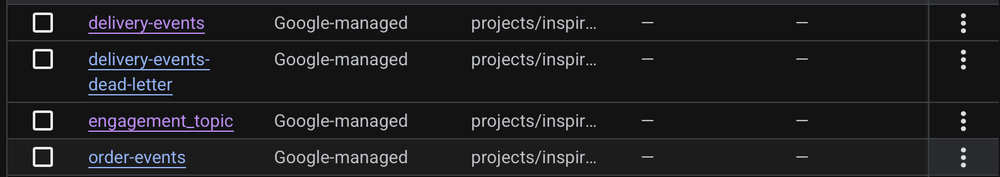
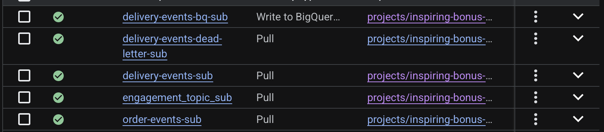
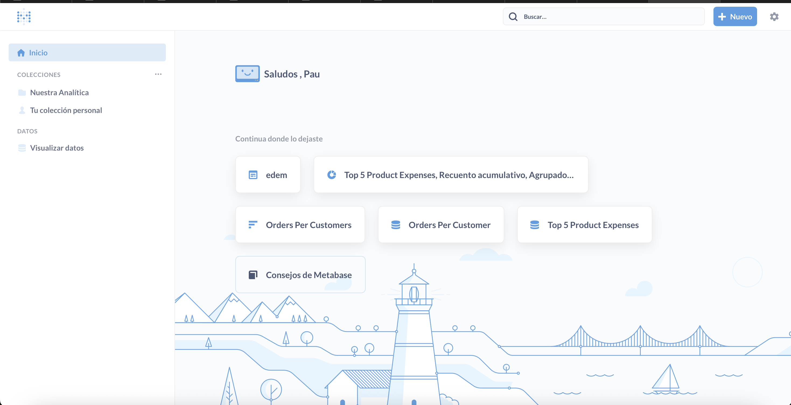
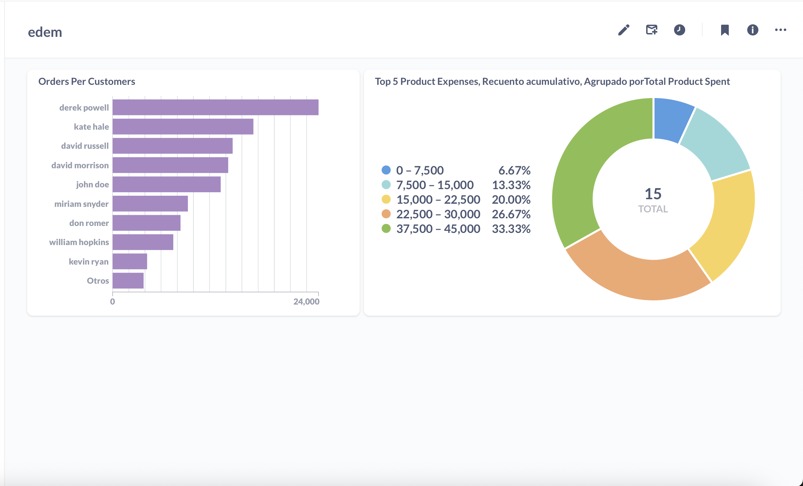
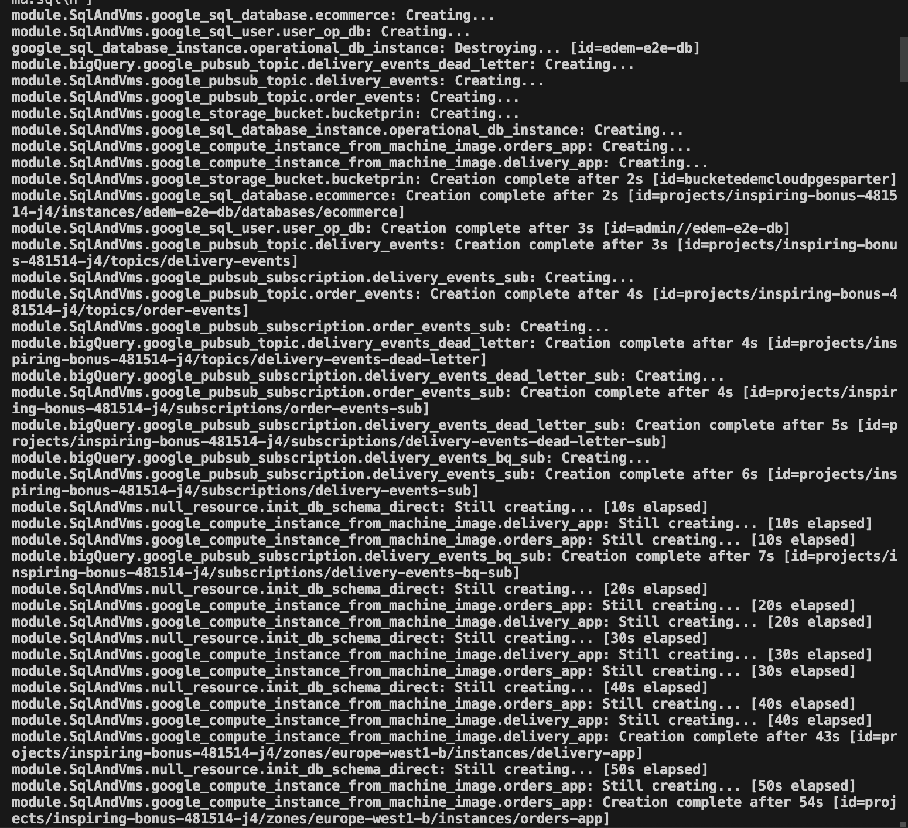

# Informe de Despliegue y Análisis de la Infraestructura

Este documento describe el proceso de despliegue, los recursos creados y el análisis de los datos y servicios desplegados en GCP utilizando Terraform. Se incluyen capturas de pantalla relevantes, almacenadas en la carpeta `images`, para ilustrar el estado y funcionamiento de la infraestructura.

---

## 1. Buckets de Cloud Storage

A continuación se muestra la lista de buckets creados en Google Cloud Storage. Estos buckets se utilizan para almacenar datos, logs y otros artefactos necesarios para el funcionamiento de la solución.

En la imagen se observa la existencia de varios buckets, entre ellos `dataflow-staging` (que sirve como landing para los datos raw) y `e2e-datalake-pgesparter`(que sirve como data lake).

---

## 2. Instancia de Cloud SQL

La siguiente imagen muestra la instancia de Cloud SQL desplegada, que utiliza PostgreSQL 17. Se observa la IP pública asignada, necesaria para la conexión desde servicios externos o scripts de inicialización.

La instancia `edem-e2e-db` está lista para aceptar conexiones y almacenar, siempre que las reglas de red y usuarios estén configurados adecuadamente.

---

## 3. Tablas y Esquemas en BigQuery

En la siguiente captura se muestran los datasets y tablas creados en BigQuery. Estos recursos permiten el análisis avanzado de los datos generados por las aplicaciones y procesos ETL.

Se observan datasets como `delivery_bronze`, `ecommerce_delivery_gold` y `orders_bronze`, cada uno con sus respectivas tablas para análisis y almacenamiento de datos procesados. Como se puede observar tenemos todas las tablas transformadas en dbt en el dataset gold.

---

## 4. Topics de Pub/Sub

A continuación se muestra la configuración de los topics creados en Google Pub/Sub, que permiten la comunicación asíncrona entre los diferentes servicios y microservicios de la arquitectura.

Se incluye un topic de DLQ para `delivery_events`.

---

## 5. Subscripciones de Pub/Sub

En la siguiente imagen se pueden ver las subscripciones asociadas a los topics de Pub/Sub. Estas subscripciones permiten que los servicios reciban y procesen los mensajes publicados en los topics.

Cada subscripción está vinculada a un topic y asegura la entrega de mensajes a los consumidores correspondientes.

---

## 6. Interfaz de Metabase

La siguiente imagen muestra la pantalla principal de Metabase, la herramienta de visualización utilizada para explorar y analizar los datos almacenados en BigQuery y otras fuentes.

Desde aquí se pueden acceder a dashboards, consultas y reportes personalizados, facilitando la toma de decisiones basada en datos.

---

## 7. Ejemplo de Dashboard: Análisis de Pedidos y Gastos

A continuación se muestra un ejemplo de dashboard en Metabase, donde se visualizan los pedidos por cliente y los gastos en productos, agrupados y segmentados para facilitar el análisis.

El gráfico de barras muestra los clientes con mayor número de pedidos, mientras que el gráfico circular segmenta los gastos en productos por rangos.

---

## 8. Proceso de Despliegue con Terraform

La siguiente captura muestra el proceso de despliegue de la infraestructura utilizando Terraform. Se observa la creación secuencial de recursos y la espera asociada a la inicialización de servicios como Cloud SQL y las VMs.

Todos los recursos estan correctamente desplegados y creados.

---

## Anexos

Se incluyen las imagenes en la carpeta `images` y el código de creacion de terraform. El codigo esta compuesto de un main.tf, y dos modulos, uno de SQL, VMS e infraestructura general y otro de Bigquery.

---
